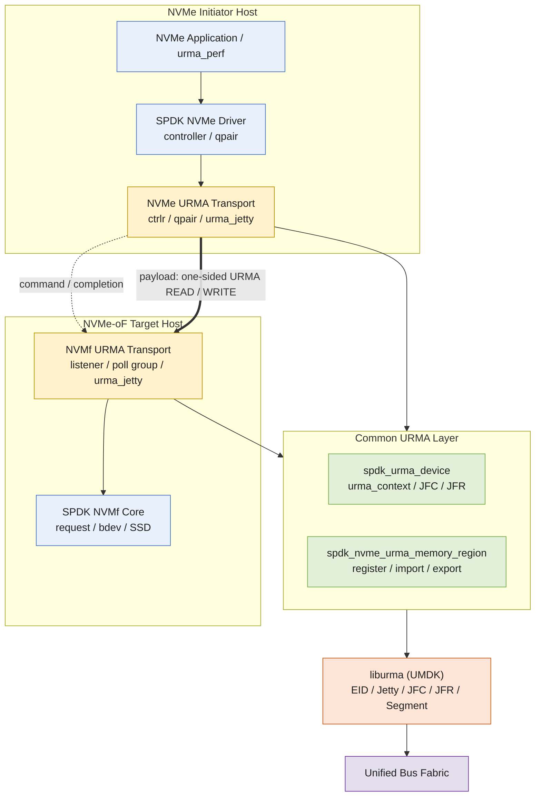
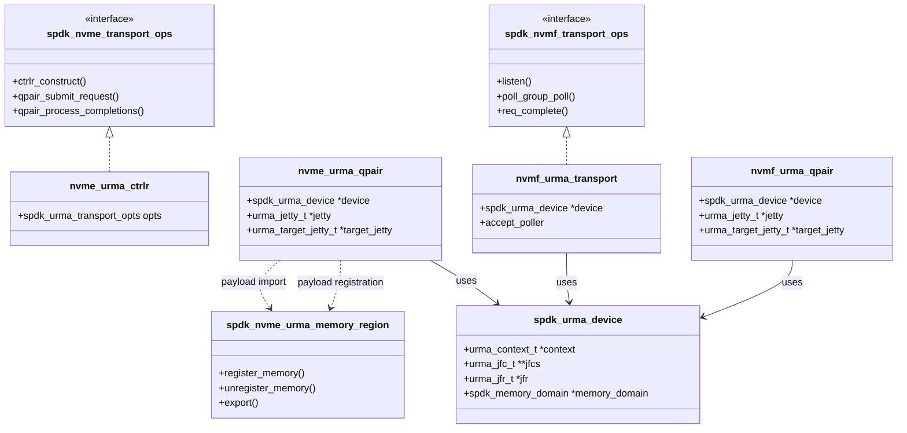
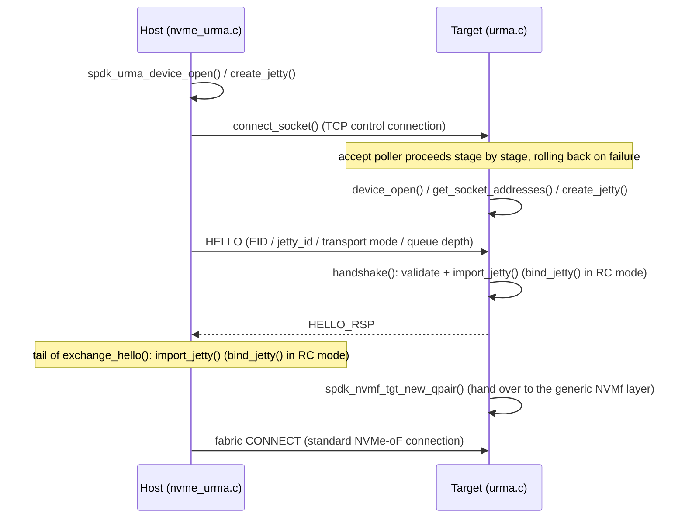

# Suggested Title

`[RFC] Add independent URMA transport support for the SPDK NVMe initiator and NVMe-oF target`

***

# Issue Body

## Background & Motivation

Unified Bus (UB) targets high-bandwidth, low-latency interconnect scenarios and sits at the **same abstraction layer** as RDMA, CXL, NVLink, and TCP. Two open-source implementations currently exist: **[URMA](https://atomgit.com/openeuler/umdk)** (remote memory access semantics) and **[OBMM](https://atomgit.com/openeuler/obmm)** (load/store semantics).

**[URMA](https://atomgit.com/openeuler/umdk)** is the unified programming abstraction and core semantic layer that the UB protocol provides for upper-layer applications. Building on the UB protocol's low-latency and high-bandwidth characteristics, URMA offers unified APIs for remote shared-memory access and operation semantics. URMA repository: https://atomgit.com/openeuler/umdk

SPDK currently provides PCIe, RDMA, TCP, VFIO-user, and other NVMe transports, but in environments that only expose a UB/URMA data plane, URMA cannot yet be selected as the fabric transport between the NVMe initiator and the NVMe-oF target. Users of such environments have to maintain an adaptation layer outside SPDK or carry downstream patches over the long term, and they cannot directly reuse SPDK's controller, qpair, poll group, NVMf request, and bdev frameworks.

We are currently optimizing large-packet transmission for KVC. For the cross-node disk data transfer scenario on Kunpeng 950, we are integrating the UB/URMA memory semantics of the UB protocol into SPDK. We would be happy to contribute this feature to the community and look forward to feedback and discussions from the experts.

The main scenarios we intend to support:

- Connect an SPDK NVMe initiator and an SPDK NVMe-oF target over a UB network;
- Transfer NVMe payloads between remote host memory and the SPDK target's I/O buffers via URMA;
- Bring GPU, NPU, and other accelerator memory directly into the remote NVMe SSD data path via the SPDK memory domain, avoiding an initiator-side HOST bounce buffer;
- Keep SPDK's existing polling model and the NVMf core, namespace, and bdev data paths unchanged.

## Proposal

### Technical Architecture

#### Protocol Stack Positioning

**Architecture Overview**

The design attaches URMA to SPDK's existing transport ops as an independent transport. The overall architecture is as follows: the upper NVMe/NVMf frameworks (blue) stay unchanged; the new code (yellow, green) is limited to the transport adapters on both sides plus a common layer (`spdk_urma_device` and `spdk_nvme_urma_memory_region`), which calls UMDK's `liburma` (orange) underneath:



**Design Principles and Components**

The proposed module responsibilities are as follows (mapping one-to-one to the actual structures in the current implementation):

| Module | Responsibility |
| --- | --- |
| nvme_urma transport (initiator) | Implements `spdk_nvme_transport_ops`: controller/qpair lifecycle, request submission, payload buffer registration and caching, completion delivery |
| nvmf_urma transport (target) | Implements `spdk_nvmf_transport_ops`: listener/poll group/qpair, capsule reception, URMA payload transfer, NVMf request progression |
| spdk_urma_device (common) | `urma_context` and JFC/JFR pools, device/EID discovery, `spdk_memory_domain` attachment |
| spdk_nvme_urma_memory_region (common) | HOST/accelerator memory registration and import, registration cache, segment export; integration with CUDA, ROCm, NPU, or DMA-BUF providers via the memory provider interface |

**Class Diagram Design**

The class diagram maps one-to-one to the current implementation: both transports implement SPDK's existing transport ops interfaces; the common layer has just two objects, `spdk_urma_device` and `spdk_nvme_urma_memory_region`; URMA endpoints (`urma_jetty` / `urma_target_jetty`) are held directly by the qpairs on each side instead of being wrapped in a separate class.



**Connection Establishment Sequence**

Both sides complete the handshake over a single TCP control connection. The host opens the device and creates its Jetty first, then connects to the target listener; on accept, the target proceeds stage by stage (device open, peer address discovery, Jetty creation); the two sides then exchange HELLO / HELLO_RSP (carrying EID, jetty_id, transport mode, and queue depth), each importing — and in RC mode binding — the peer's Jetty, before entering the standard NVMe-oF connection flow. Any failed stage logs an error and releases the resources already created:



### Build and configuration

We propose adding a build option that is disabled by default:

```bash
./configure --with-urma[=/path/to/umdk]
```

When enabled, the build verifies the URMA public headers and `liburma`; when disabled, no URMA sources are compiled, `liburma` is not linked, and the transport behavior of existing SPDK binaries is unchanged.

The NVMf target still creates its transport and listener through the generic RPCs, for example:

```bash
scripts/rpc.py nvmf_create_transport -t URMA
scripts/rpc.py nvmf_subsystem_add_listener <nqn> \
    -t URMA -a <address> -s <service>
```

Parameters such as device name, EID, transport mode, JFC/Jetty depth, worker count, and batch size should be provided through transport-specific options; the final field names and default values will be settled with the community before implementation.

### Transport identity and discovery

URMA needs an independent transport identity, registered through both `spdk_nvme_transport_ops` and `spdk_nvmf_transport_ops`. For the first stage we propose supporting explicit direct connect with `trtype:URMA`.

Because the NVMe-oF specification has not yet assigned a standard TRTYPE for URMA, this proposal does not fix a wire-level value up front and does not write a temporary internal enum value into the 8-bit discovery TRTYPE. The following points should be confirmed with the community before coding starts:

- whether an SPDK-internal fabric transport type marked as experimental is acceptable;
- whether this should be built on the `CUSTOM_FABRICS` extension instead of adding a new public enum value;
- when and how a URMA listener would appear in a standard discovery response;
- how EID, service, UPI, and other transport-specific address information is encoded.

## Compatibility and Impact

| Aspect | Expected impact |
| --- | --- |
| Backward compatibility | The feature is off by default; existing transport interfaces and code paths are unchanged |
| Build dependencies | Depends on UMDK public headers and `liburma` only when `--with-urma` is used |
| NVMe/NVMf core | Keeps using the generic controller, qpair, request, namespace, and bdev logic |
| Wire compatibility | The initial version is an experimental binding; it does not interoperate with NVMe/RDMA and does not misuse a standard TRTYPE |
| Performance | Expected to remove the software adaptation layer in UB environments; the accelerator direct mode can avoid initiator HOST staging |
| Maintenance | URMA code is isolated from the RDMA/TCP transports; shared changes are limited to transport registration, parsing, build, and memory-domain interfaces |
