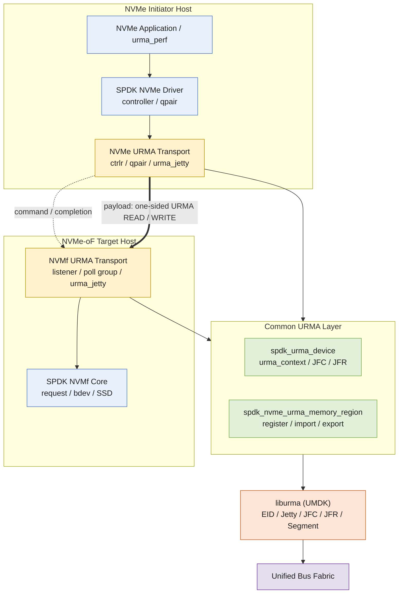
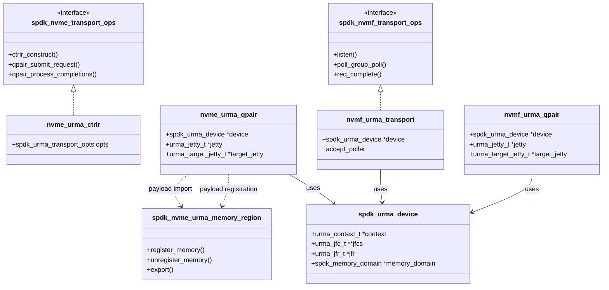
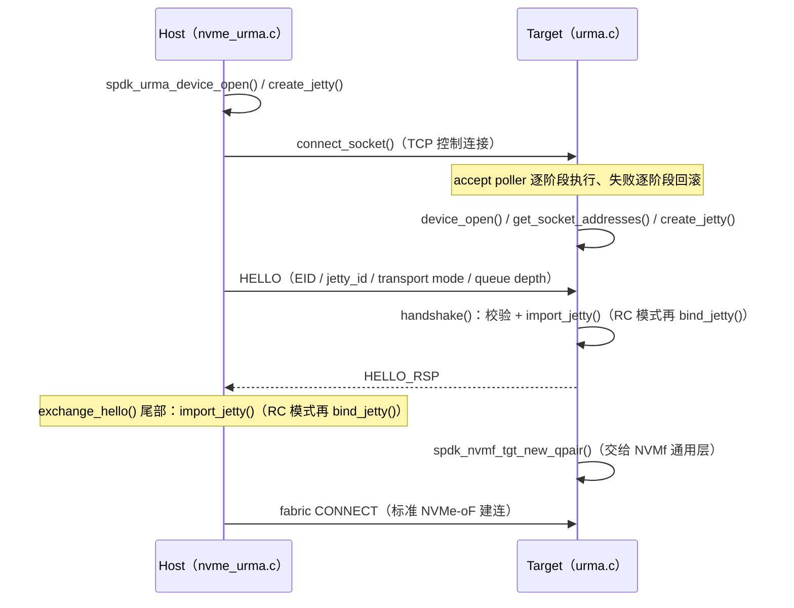

# 建议标题

`[RFC] 为 SPDK NVMe Initiator 与 NVMe-oF Target 增加独立 URMA Transport 支持`

***

# Issue 正文

## Background & Motivation

Unified Bus（UB）面向高带宽、低时延互连场景，与RDMA、CXL、NVLink和TCP处于**同一抽象层**。目前存在两个开源实现：\*\*[URMA](https://atomgit.com/openeuler/umdk) \*\*（远程内存访问语义）和 **[OBMM](https://atomgit.com/openeuler/obmm)**（加载/存储语义）。

**[URMA](https://atomgit.com/openeuler/umdk)是**UB协议为上层应用提供的统一编程抽象和核心语义层。URMA基于UB协议的低延迟和高带宽特性，提供统一的远程共享内存访问和操作语义API。URMA仓库链接：<https://atomgit.com/openeuler/umdk>

SPDK 目前提供 PCIe、RDMA、TCP、VFIO-user 等 NVMe transport，但尚不能在仅提供 UB/URMA 数据面的环境中，将 URMA 作为 NVMe initiator 与 NVMe-oF target 之间可选择的 fabric transport。使用这类环境的用户只能在 SPDK 之外维护适配层或长期维护下游补丁，也无法直接复用 SPDK 的 controller、qpair、poll group、NVMf request 和 bdev 框架。

我们目前正在优化KVC的大数据包传输。对于鲲鹏950的跨节点硬盘数据传输场景，我们正在尝试将UB协议下的UB/URMA内存语义集成到SPDK中。我很高兴能为社区贡献这个功能，并期待专家们的反馈和讨论。

支持的主要场景包括：

- 在 UB 网络中连接 SPDK NVMe initiator 与 SPDK NVMe-oF target；
- 通过 URMA 在远端主机内存与 SPDK target 的 I/O buffer 之间传输 NVMe payload；
- 结合 SPDK memory domain，将 GPU、NPU 等加速器内存直接接入远端 NVMe SSD 数据路径，并避免 initiator 侧的 HOST bounce buffer；
- 保留 SPDK 现有轮询模型以及 NVMf core、namespace 和 bdev 数据路径。

## Proposal

### Technical Architecture

#### Protocol Stack Positioning

**Architecture Overview**

架构设计将 URMA 作为独立 transport 挂接到 SPDK 已有的 transport ops。整体架构如下：上层 NVMe/NVMf 框架（蓝色）保持不变，新增（黄色、绿色）两侧 transport 适配和公共层（`spdk_urma_device` 与 `spdk_nvme_urma_memory_region`），向下调用 UMDK 的 `liburma`（橙色）：



**Design Principles and Components**

建议的模块职责如下（与当前实现中的实际结构一一对应）：

| 模块 | 职责 |
| --- | --- |
| nvme_urma transport（initiator） | 实现 `spdk_nvme_transport_ops`：controller/qpair 生命周期、请求提交、payload buffer 注册与缓存、completion 返回 |
| nvmf_urma transport（target） | 实现 `spdk_nvmf_transport_ops`：listener/poll group/qpair、capsule 接收、URMA payload 搬运、NVMf request 推进 |
| spdk_urma_device（公共） | `urma_context` 与 JFC/JFR 池、设备/EID 发现、`spdk_memory_domain` 挂接 |
| spdk_nvme_urma_memory_region（公共） | HOST/加速器内存的注册与导入、注册缓存、segment 导出；通过 memory provider 接口对接 CUDA、ROCm、NPU 或 DMA-BUF |

**Class Diagram Design**

类图与当前实现一一对应：两侧 transport 分别实现 SPDK 已有的 transport ops 接口；公共层只有 `spdk_urma_device` 和 `spdk_nvme_urma_memory_region` 两个对象；URMA 端点（`urma_jetty` / `urma_target_jetty`）由两侧 qpair 直接持有，不做二次封装。



**Connection Establishment Sequence**

两侧通过一条 TCP 控制连接完成握手。host 侧先打开设备并创建 Jetty，再连接 target listener；target accept 后逐阶段执行设备打开、对端地址获取、Jetty 创建；随后双方交换 HELLO / HELLO_RSP（携带 EID、jetty_id、transport mode、queue depth），各自 import 并在 RC 模式下 bind 对端 Jetty，之后进入标准 NVMe-oF 建连流程。任一阶段失败都会输出错误日志并释放已创建的资源：



### Build and configuration

建议增加默认关闭的编译开关：

```bash
./configure --with-urma[=/path/to/umdk]
```

启用时检查 URMA public headers 与 `liburma`；关闭时不编译 URMA 源文件、不链接 `liburma`，也不改变现有 SPDK 二进制的 transport 行为。

NVMf target 仍通过通用 RPC 创建 transport 和 listener，例如：

```bash
scripts/rpc.py nvmf_create_transport -t URMA
scripts/rpc.py nvmf_subsystem_add_listener <nqn> \
    -t URMA -a <address> -s <service>
```

设备名、EID、transport mode、JFC/Jetty 深度、worker 数和 batch size 等参数应使用 transport-specific options；最终字段名和默认值在实现前由社区讨论确定。

### Transport identity and discovery

URMA 需要独立的 transport identity，并由 `spdk_nvme_transport_ops` 与 `spdk_nvmf_transport_ops` 注册。建议第一阶段支持 `trtype:URMA` 的显式 direct connect。

由于 NVMe-oF 规范目前没有为 URMA 分配标准 TRTYPE，本提案不预先固定 wire-level 数值，也不将一个临时内部枚举值写入 8-bit discovery TRTYPE。以下事项应在编码前由社区确认：

- 是否接受一个标记为 experimental 的 SPDK 内部 fabric transport type；
- 是否应基于 `CUSTOM_FABRICS` 扩展，而不是增加新的公共枚举值；
- URMA listener 何时以及如何进入标准 discovery response；
- EID、service、UPI 和其他 transport-specific address 信息的编码方式。

## Compatibility and Impact

| 方面 | 预期影响 |
| --- | --- |
| Backward compatibility | 功能默认关闭；不修改现有 transport 的接口与运行路径 |
| Build dependencies | 仅在 `--with-urma` 时依赖 UMDK public headers 和 `liburma` |
| NVMe/NVMf core | 继续使用通用 controller、qpair、request、namespace 和 bdev 逻辑 |
| Wire compatibility | 初始版本为 experimental binding，不与 NVMe/RDMA 互通，也不冒用标准 TRTYPE |
| Performance | 预期减少 UB 环境中的软件适配层；accelerator direct 模式可避免 initiator HOST staging |
| Maintenance | URMA 代码与 RDMA/TCP transport 隔离，公共修改限制在 transport 注册、解析、构建和 memory-domain 接口 |
